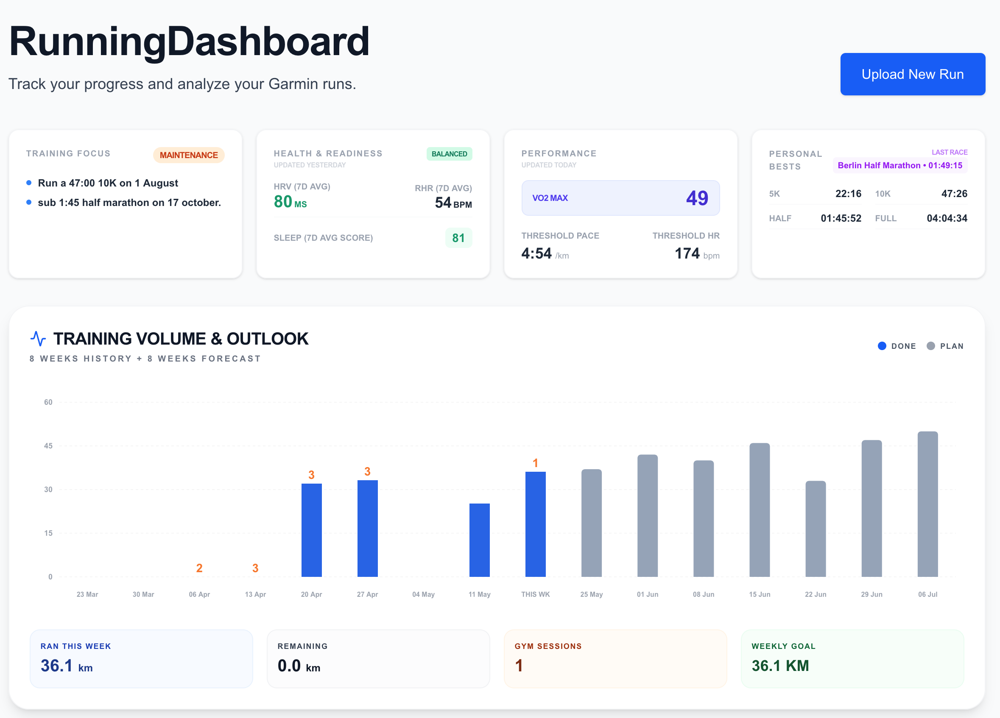
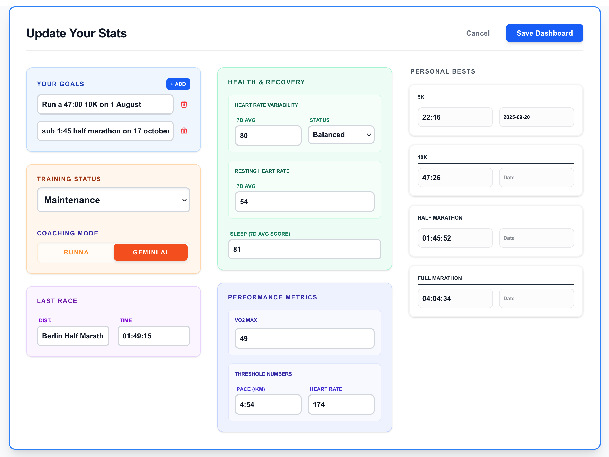
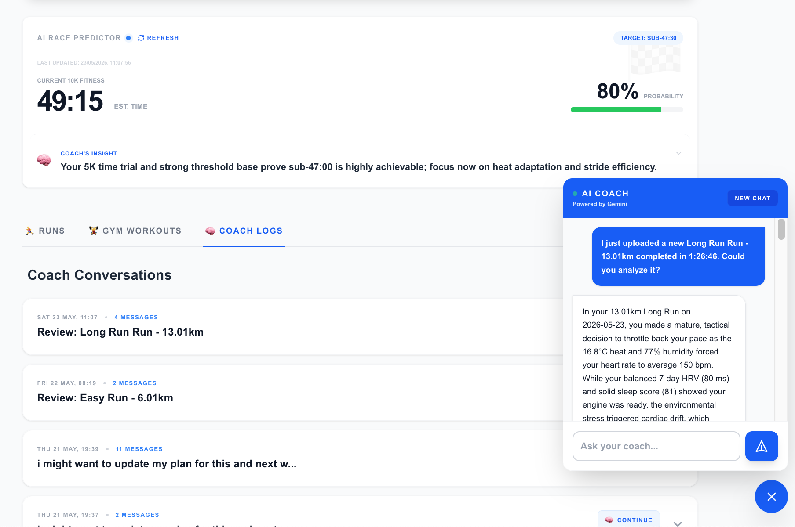
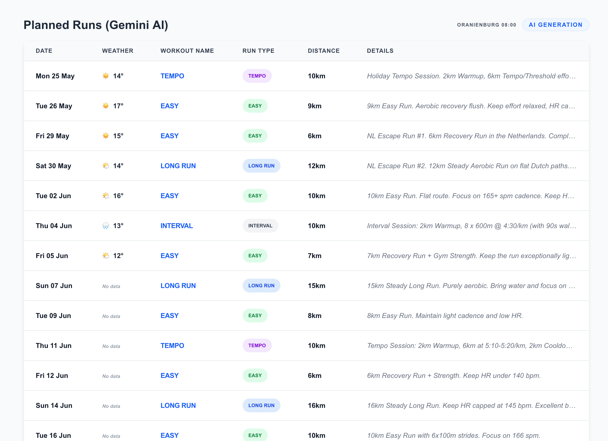
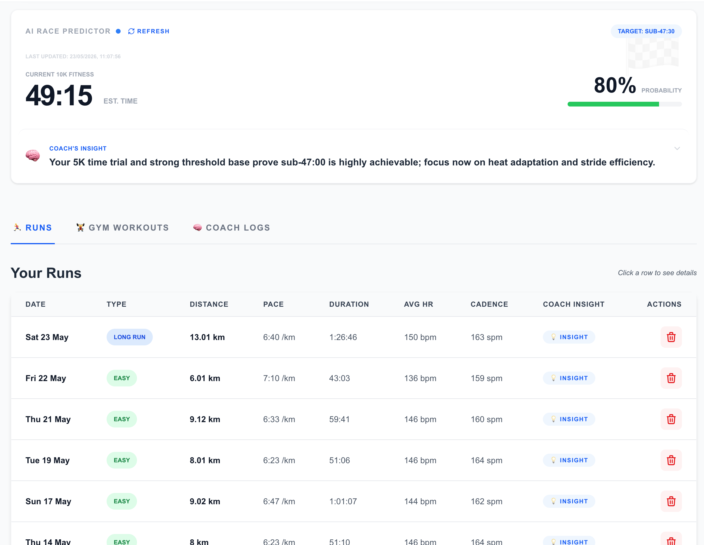

# RunningDashboard 🏃‍♂️🧠

RunningDashboard is an AI-powered performance analysis tool designed for endurance athletes. It transforms raw Garmin data into actionable coaching insights using Google's Gemini Pro API, helping athletes optimize their training, monitor physiological readiness, and predict race performance.

## Key Features

### 🧠 AI Running Coach (Gemini Pro)

- **Automated Run Reviews:** Every uploaded run is analyzed by an "AI Coach" that provides punchy, specific feedback on pace, heart rate, and training structure.

- **Context-Aware Insights:** The coach considers 7-day physiological trends (HRV, Sleep, RHR) and upcoming planned workouts to provide holistic advice.
- **Interactive Chat:** Ask the coach specific questions about your training plan, fatigue levels, or upcoming race strategy.

### 📊 Performance Analytics & Predictions

- **Race Predictor:** Estimates current 10K fitness based on volume, consistency, and specific intensity sessions.
- **Physiological Monitoring:** Tracks VO2 Max, Lactate Threshold, and Heart Rate Variability (HRV) trends.
- **Weekly Strategy Reports:** Generates a 4-pillar report covering training phases, fitness status, biomechanics trends, and short-term strategy.

### 📅 Training Management

- **Integrated Calendar:** Syncs with Google Calendar to track upcoming planned runs.
- **Gym Workout Logging:** Tracks strength training sessions to ensure a balanced approach to endurance and power.
- **Automated Periodization:** Proposes deload weeks and race tapers based on accumulated fatigue and performance signals.

## Technical Stack

- **Framework:** [Next.js](https://nextjs.org/) (React, TypeScript)
- **Backend/DB:** [Firebase](https://firebase.google.com/) (Firestore, Authentication, Hosting)
- **AI Engine:** [Google Gemini Pro API](https://ai.google.dev/)
- **Styling:** Vanilla CSS / Tailwind CSS
- **Integration:** Google Calendar API

## Security & Privacy Note

This is a personal tool built specifically for the owner's training data.
- **Access Control:** The application uses Firebase Authentication and is restricted via an `AuthGuard` to a specific authorized user.
- **Data Protection:** No sensitive API keys or credentials are stored in the codebase; all configuration is managed through secure environment variables.
- **Firestore Security:** Rules are configured to restrict read/write access to authenticated authorized sessions only.

## Getting Started

### Prerequisites
- Node.js 18+
- Firebase Project
- Google Gemini API Key

### Installation
1. Clone the repository
2. Install dependencies: `npm install`
3. Create a `.env.local` file with your credentials (see `apphosting.yaml` for required variables)
4. Run the development server: `npm run dev`

---
*Built for athletes who want more than just numbers.*
