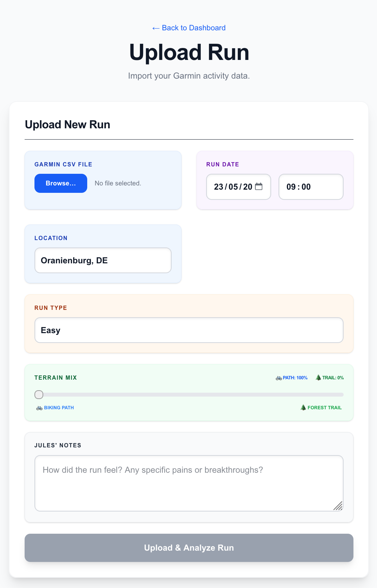

# RunningDashboard 🏃‍♂️🧠

RunningDashboard is an AI-powered performance analysis tool designed for endurance athletes. It transforms raw Garmin data into actionable coaching insights using Google's Gemini Pro API, helping athletes optimize their training, monitor physiological readiness, and predict race performance.

## Key Features

### 🧠 AI Training Strategy & Planning

- **Automated Periodization:** The AI Coach generates structured 2-month training plans, incorporating deload weeks and race tapers based on your specific goals.
- **Interactive Coaching:** Chat with "The Coach" to revise your plan, ask about specific sessions, or adjust intensity based on how you feel.
- **Goal-Oriented Guidance:** Specifically tuned for marathon and 10K targets, focusing on the athlete's unique physiological profile.

### 📤 Seamless Data Integration & Analysis

- **Automated Run Reviews:** Upload your Garmin CSV data for immediate, punchy feedback on every session.
- **Structure Identification:** The AI distinguishes between warmups, main efforts, and cooldowns to judge the true quality of a workout.
- **Feedback Loop:** Every review is tailored to the athlete's history, ensuring advice is always contextual.

### 📈 Context-Aware Physiological Insights

- **Holistic Readiness:** Integrates 7-day trends for Heart Rate Variability (HRV), Resting Heart Rate (RHR), and Sleep scores.
- **Biological Context:** The coach uses these "readiness" signals to explain performance variations and suggest recovery when metrics trend poorly.
- **Performance Tracking:** Real-time visibility into VO2 Max and Lactate Threshold progress.

### 📊 Performance Analytics & Predictions

- **Race Predictor:** Estimates current 10K fitness by analyzing volume, consistency, and intensity sessions from the last 20 runs.
- **Trend Analysis:** Visualizes training load and pace improvements over time.
- **Historical Context:** Easy access to past run data to compare similar sessions and track long-term growth.

## Technical Stack

- **Framework:** [Next.js](https://nextjs.org/) (React, TypeScript)
- **Backend/DB:** [Firebase](https://firebase.google.com/) (Firestore, Authentication, Hosting)
- **AI Engine:** [Google Gemini Pro API](https://ai.google.dev/)
- **Styling:** Vanilla CSS / Tailwind CSS
- **Integration:** Google Calendar API

## Security & Privacy Note

This is a personal tool built specifically for the owner's training data.
- **Access Control:** The application uses Firebase Authentication and is restricted via an `AuthGuard` to a specific authorized user.
- **Data Protection:** No sensitive API keys or credentials are stored in the codebase; all configuration is managed through secure environment variables.
- **Firestore Security:** Rules are configured to restrict read/write access to the specific authorized owner only.

## Getting Started

### Prerequisites
- Node.js 18+
- Firebase Project
- Google Gemini API Key

### Installation
1. Clone the repository
2. Install dependencies: `npm install`
3. Create a `.env.local` file with your credentials
4. Run the development server: `npm run dev`

---
*Built for athletes who want more than just numbers.*
